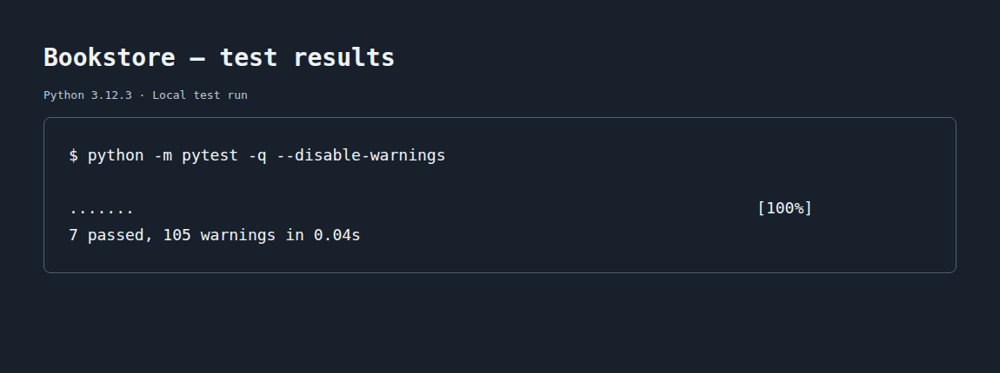

# Bookstore

A Python OOP lab with two classes for items in a bookstore.

## Classes

- `Book(title, page_count)` stores a title and an integer page count. Its
  `page_count` property prints `page_count must be an integer` when given an
  invalid value. `turn_page()` prints `Flipping the page...wow, you read fast!`.
- `Coffee(size, price)` stores a size and a price. Its `size` property accepts
  `Small`, `Medium`, or `Large` and prints `size must be Small, Medium, or Large`
  for other values. `tip()` prints `This coffee is great, here’s a tip!` and
  adds 1 to the price each time it is called.

Invalid assignments leave previously accepted values unchanged.

## Setup

The starter's Pipfile specifies Python 3.8.13. With that version and Pipenv
installed, run these commands from the project folder:

```bash
pipenv install
pipenv shell
```

The local environment was verified with Python 3.12.3. To use the existing
environment on this machine, run `source .venv/bin/activate`, then `pytest`.

## Example

```python
from lib.book import Book
from lib.coffee import Coffee

book = Book("And Then There Were None", 272)
book.turn_page()

coffee = Coffee("Medium", 2.50)
coffee.tip()
print(coffee.price)  # 3.5
```

## Tests

Run all seven tests from the project folder:

```bash
pipenv run pytest
```

Or run the tests for one class:

```bash
pipenv run pytest -x lib/testing/book_test.py
pipenv run pytest -x lib/testing/coffee_test.py
```

### Completed work

All seven tests pass locally. GitHub Actions runs the tests on Python 3.8 and 3.12.



## Resources

- [Original lab](https://github.com/learn-co-curriculum/python-oop1-lab)
- [Python classes tutorial](https://docs.python.org/3/tutorial/classes.html)
